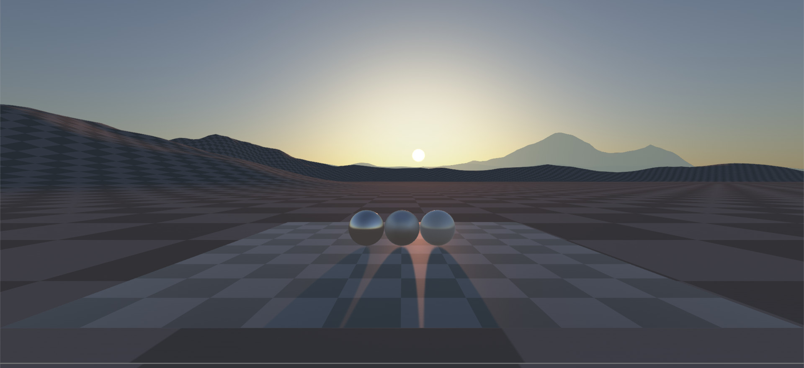
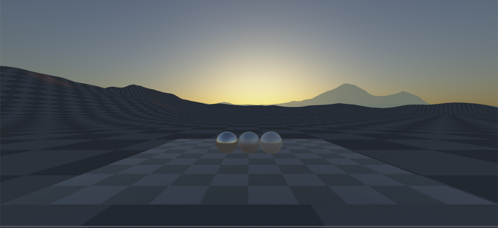
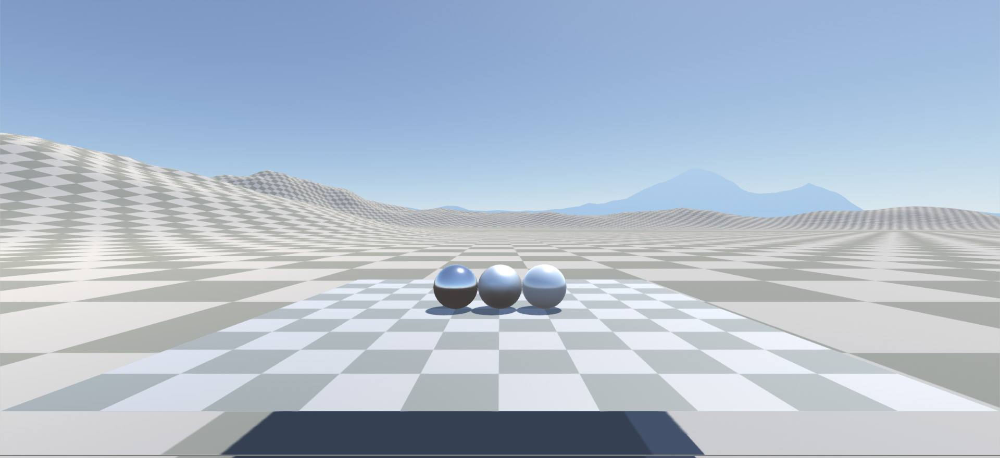
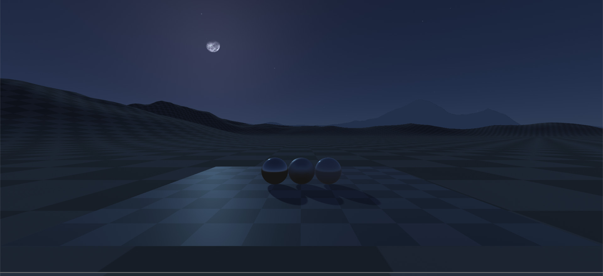

# Celeste Sky
----------------

> Dynamic Skydome for Unity Engine.
--------------------------------------

--------------------------------------

Status:
-----------

>- Status: 2.0
>- Support: Built In Render/Mono Behaivour.

Features:
-----------

Outer Space:
--------------
- Deep space based on cubemaps.
- Stars field based on cubemaps.
- Moon phases.
- Realistic sun and moon coordinates.
--------------

Atmosphere:
--------------
- Atmospheric scattering based on Preetham and Hoffman papers.
- Night support.
- Artistic control.
- Fog tinted with sky color.
--------------

Clouds:
--------------
- Simple clouds(They will be improved in the future).
--------------

Time Of Day:
--------------
- DateTime manager.
- Celestials positions based on date time and location.
--------------

Rendering:
--------------
- HDR/LDR support.
- Gamma/Linear support.
- Forward/Deferred support.
- Skydome.
- Exclude/Render layers support.
--------------